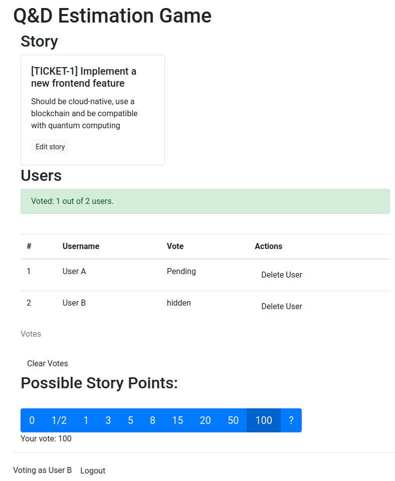

# A tiny Scrum Estimation tool

This software aims to be a minimal but usable poker-like estimation game for Scrum teams.



It is implemented as a single page app with [Flask](https://flask.palletsprojects.com/en/1.1.x/) and [Vue.js](https://vuejs.org). Events are propagates to the clients by socket.io.

**Disclaimer:**
This software is meant to be run in a protected environment. Issues around authorization and authentication are not being addressed by this software itself.

## How to start

For development, two servers are started:
- The backend server, a flask development server.
- The dev server from vue-cli (based on webpack-dev-server with Hot-Module-Replacement) - run via `npm run serve`. This server also proxies API and websocket requests to the backend server.
   

1. Install backend requirements and setup database in folder [backend](./backend):

    ```sh    
    cd backend
    python3.8 -m venv venv
    source venv/bin/activate
    pip install -r requirements.txt
    python setup.py    
    ```
   
   Start backend server in dev mode:
   ```sh      
   FLASK_ENV=development flask run
    ```   

    Test availability:  
    ```
   curl http://127.0.0.1:5000/api/ping
    ```
   > "pong!"

2. Run the Vue.js client in folder [client](./client):

    ```sh
    cd client
    npm install
    npm run serve
    ```
 
3.  Test availability. 
    ```
   curl http://localhost:8080/
    ``` 
   > HTML output...

 *Beware:* If port 8080 is already in use, the next free port will be used. It has to be provided in [config.js](client/src/config.js)

   Test API proxy to backend server (requires running backend server):
   ```
   curl http://localhost:8080/api/ping
   ```
   > "pong!"
   

4. Build for production
    ```sh
    cd client    
    npm run build
    cd ..
    docker build . -t estimationgame
    ``` 

5. Run docker container
```
docker run --name estimationgame -p 80:80 estimationgame
```

### Log files
  Stdout and log from python gets into `/var/log/gunicorn/error.log`.
  Access log is visible in `/var/log/gunicorn/access.log` and on stdout. 

## Notes

Working with websockets makes things tough. Did not manage to make 
them work with uwsgi. Gunicorn (the current solution) can use
only a single worker. Setting is done in [start.sh](start.sh)

- https://flask-socketio.readthedocs.io/en/latest/#gunicorn-web-server
- https://github.com/miguelgrinberg/Flask-SocketIO/issues/402